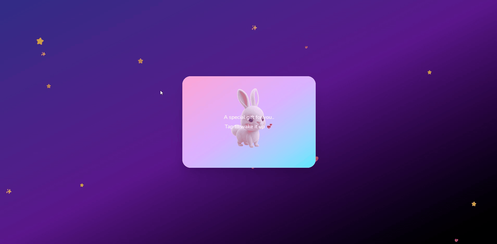

# Lovia 💖


Create and share magical digital love cards — with cute companions, background music, and a personalized message — all through a single shareable link. No account required.

🌐 **Live:** https://www.loviaforyou.com

---

<p align="center">
  
  &nbsp;&nbsp;
  
</p>

---

## Features

- **Cute companions** — pick from classic animals or seasonal characters (Christmas, Halloween, Birthday, BFF)
- **Custom photo** — upload your own image instead of the default animal
- **Background music** — choose a mood: Romantic, Dreamy, or Happy
- **Shareable link** — every card gets a unique short URL (e.g. `/card/abc123`)
- **Open tracking** — see when your card was opened via the status page
- **Open Graph previews** — cards look great when shared on WhatsApp, iMessage, Instagram
- **No signup** — create and share in under a minute, completely free

---

## Tech stack

| Layer    | Technology                         |
|----------|------------------------------------|
| Frontend | Next.js 14 (App Router, React 18)  |
| Styling  | Tailwind CSS                       |
| Database | Supabase (PostgreSQL + Storage)    |
| Hosting  | Azure Static Web Apps              |
| CI/CD    | GitHub Actions                     |

---

## Architecture

```
User
 │
 ▼
Next.js — Azure Static Web Apps
 │
 ▼
Supabase — PostgreSQL (cards) + Storage (card-images)
```

Card data (recipient, message, animal, music choice, optional photo URL) is stored in a `cards` table. Photos are uploaded to a Supabase Storage bucket and served via public URL. Each card is identified by a 6-character random ID.

---

## Local development

```bash
git clone https://github.com/R0s3mrcx/lovia.git
cd lovia
npm install
cp .env.local.example .env.local
# fill in your Supabase credentials
npm run dev
```

Open [http://localhost:3000](http://localhost:3000).

---

## Environment variables

```env
NEXT_PUBLIC_SUPABASE_URL=your_project_url
NEXT_PUBLIC_SUPABASE_ANON_KEY=your_anon_key
```

Both variables must also be set in Azure Static Web Apps → Configuration.

---

## Supabase setup

**Database — `cards` table:**

```sql
create table cards (
  id          text primary key,
  animal      text not null,
  "to"        text not null,
  "from"      text not null,
  message     text not null,
  music       text default 'none',
  image_url   text,
  opened_at   timestamptz,
  created_at  timestamptz default now()
);
```

**Storage — `card-images` bucket:**

1. Create a bucket named `card-images` and set it to **Public**
2. Add a Storage Policy allowing anonymous uploads:
   - Operation: `INSERT`
   - Role: `anon`
   - Policy: `true`

---

## Music

Drop three royalty-free MP3s into `/public/music/` (Pixabay Music works well — no attribution required):

```
public/
  music/
    romantic.mp3
    dreamy.mp3
    happy.mp3
```

The app degrades gracefully if the files are missing.

---

## Deployment

Deployment is automatic. Any push to `main` triggers the GitHub Actions workflow, which builds the Next.js app and deploys it to Azure Static Web Apps.

---

## License

Source-available. The code is public for educational and portfolio purposes. Commercial use, redistribution, or cloning for profit is not permitted without explicit permission from the author. See [LICENSE](./LICENSE) for details.
